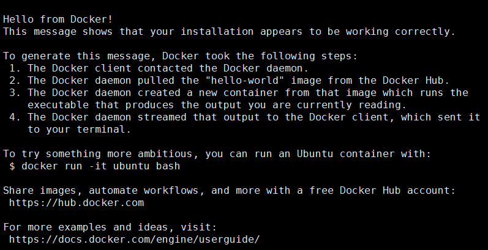

```
Docker入门基础
Author：LiNing
```

### Docker 介绍：

**[Docker](https://github.com/docker/docker)**是能够把应用程序自动部署到容器的开源引擎，而**容器**是一种依托于Linux内核的虚拟化技术，也就是说，如果我们想要一种**“隔离”**的环境来进行开发，那就用Docker吧。

一说到虚拟化，很自然会联想到虚拟机，比如我们常用的VMWare。我们可以在宿主机上再安装一个操作系统，Windows、Linux等。这样在安装好的操作系统内进行任何操作，都不会影响到外面的宿主机也就是我们本机电脑的环境。这样的好处在于，我们可以方便地去进行不同系统的学习以及模拟多台机器的交互。

与虚拟机不同，Docker不需要我们在宿主机上重新安装一个操作系统，它依赖于宿主机环境，这样大大节省了程序部署及运行所需要的空间和时间。而Docker容器内的操作，也完全影响不到宿主机，更不会影响到其他容器。

 

Docker主要由几部分组成：**客户端**，**服务端**，**远程仓库**。Docker采用了C/S架构，用户通过在本地客户端，访问远程服务端的守护进程，从而操纵容器。

容器是通过镜像来创建的，而镜像保存在仓库中。需要注意的是，容器类似于会话，只不过它的操作仅仅限于容器内部，而镜像类似于操作系统，我们可以通过操作系统创建多个会话，类似的，**通过一个镜像可以创建多个容器**。

 

对于Ubuntu Linux操作系统，Docker要求是**64位**操作系统，如Ubuntu Trusty 14.04 (LTS)，并且内核发行号最低要求3.10。
在安装前需要检查内核发型号：**uname -a**

### Docker 安装：

安装方式有两种。

* 安装Ubuntu维护的版本（推荐）：

1.更新apt数据源：

	sudo apt-get update
	sudo apt-get install apt-transport-https ca-certificates
	sudo apt-key adv --keyserver hkp://p80.pool.sks-keyservers.net:80 --recv-keys 58118E89F3A912897C070ADBF76221572C52609D
	echo "deb https://apt.dockerproject.org/repo ubuntu-trusty main" | sudo tee /etc/apt/sources.list.d/docker.list
	sudo apt-get update
	sudo apt-get purge lxc-docker
	sudo apt-cache policy docker-engine

2.安装Docker：
	
	sudo apt-get update
	sudo apt-get install docker-engine

* 安装Docker维护的版本：

	sudo apt-get update
	sudo apt-get install curl
	curl -fsSL https://get.docker.com/ | sh
	

### Docker 运行：

安装完Docker后，我们需要在系统上启动Docker服务：sudo service docker start

这样，我们就可以运行Docker了。

比如，查看Docker版本：
	
	docker version

 
	
运行hello-world镜像：
	
	docker run hello-world
	
	这里，Docker会首先检查本地是否存在hello-world镜像，如果没有，则从Docker Hub上拉取，再运行

 

关于Docker命令，有很多，直接输入**docker help**可以查看，讲的很清楚。一起来体验Docker吧~
