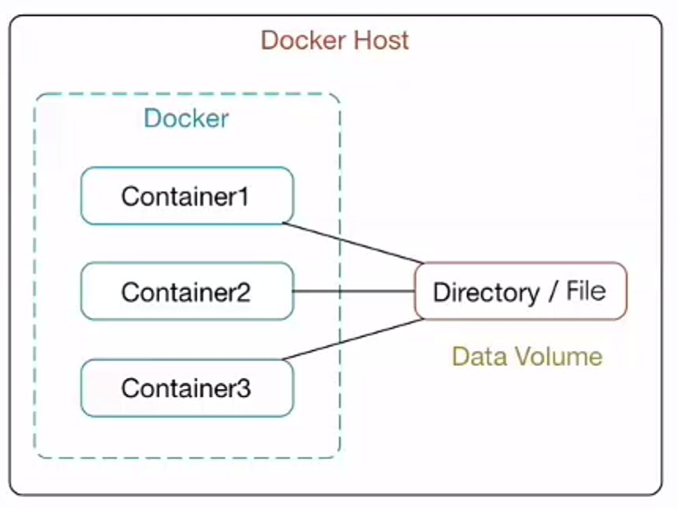
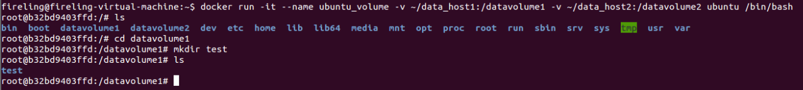
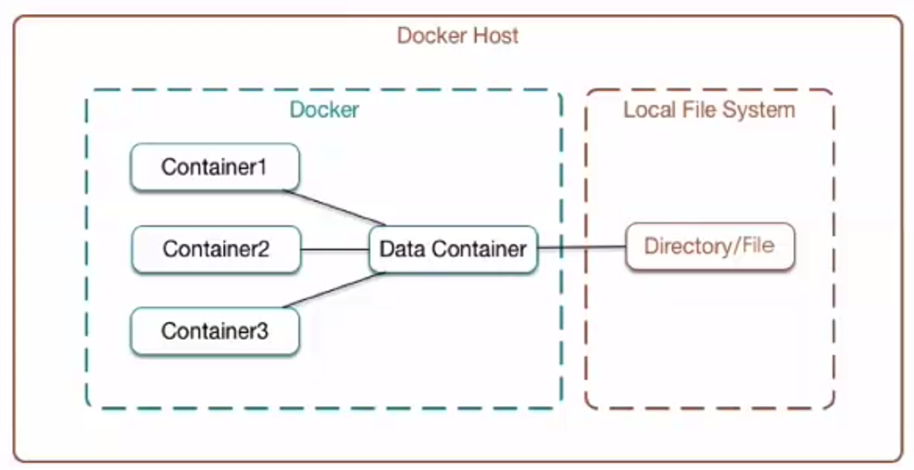
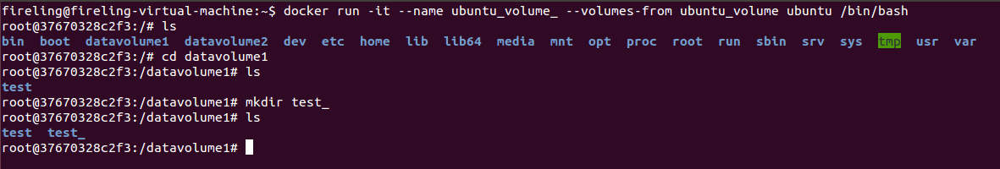
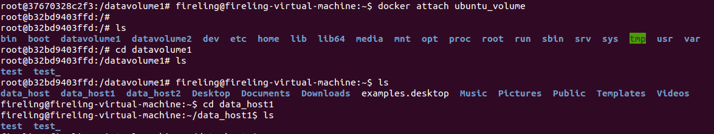

```
Docker数据卷与数据容器
Author：LiNing
```

#### 为什么要用数据卷

在Docker容器运行期间，对文件系统的所有修改都会以增量的方式反映在容器使用的联合文件系统中，并不是真正的对只读层数据信息修改。每次运行容器对它的修改，只能适用于当前Docker容器，当删除该容器，或通过该镜像重新启动时，之前的更改将会丢失。这样做并不便于我们持久化和共享数据，而Docker的数据卷可以解决这个问题。

数据卷是经过特殊设计的目录，可以绕过容器使用的联合文件系统(Union File System)，为一个或多个容器提供访问。数据卷本质上对应的是宿主机的文件目录。



数据卷设计的目的在于数据的持久化和共享数据，它完全独立于容器的生存周期。因此，Docker不会在容器删除时删除其挂载的数据卷，也不会存在类似的垃圾收集机制，对容器引用的数据卷进行处理。

#### 容器与宿主机之间的数据共享

建立一个名为ubuntu_volume的交互式容器，并挂载主机目录~/data_host1，对应容器目录/datavolume1，同时挂载主机目录~/data_host2，对应容器目录/datavolume2。当然使用DockerFile构建包含数据卷的容器也是可以的。这样，我们不论在主机目录~/data_host中做修改，还是在容器目录/datavolume中做修改，都会彼此同步。

	docker run -it --name ubuntu_volume -v ~/data_host1:/datavolume1 -v ~/data_host2:/datavolume2 ubuntu /bin/bash
	cd datavolume1
	mkdir test



这样，在容器的目录/datavolume1中创建了test目录，可以反映到宿主机的~/data_host1中。

我们可以查看该容器，或者查看容器挂载的数据卷。

	docker inspect ubuntu_volume 	
	docker volume ls

如果要删除容器挂载的数据卷，有两种办法：一种就是删除容器的同时删除其挂载的数据卷，如**docker rm -v ubuntu_volume**；另外一种办法，就是查看容器中未被挂载的数据卷，记录其ID，再用**docker volume rm**命令删除。

#### 容器与容器之间的数据共享

有的时候，我们并不想指定挂载的宿主机的目录，或者说，我们只想实现容器与容器之间的数据共享，这就需要用到数据卷容器。顾名思义，数据卷容器就是挂载着数据卷的容器，其他容器通过挂载这个容器来实现数据共享。



比如，挂载之前创建的ubuntu_volume容器：
	
	docker run -it --name ubuntu_volume_ --volumes-from ubuntu_volume ubuntu /bin/bash
	cd datavolume1
	mkdir test_



这样，在新建的名为ubuntu\_volume\_的交互式容器下，挂载了容器ubuntu_volume。

同样，我们可以在容器ubuntu\_volume\_的datavolume1中创建test_目录，这样的更改不仅可以反映到容器ubuntu_volume的datavolume1中，还能反映到ubuntu_volume挂载的宿主机目录~/data_host1中。

查看容器ubuntu_volume的datavolume1目录和宿主机目录~/data_host1：




