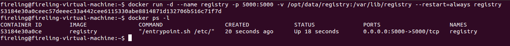
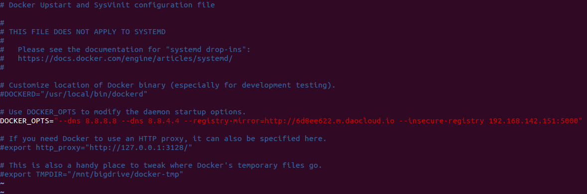
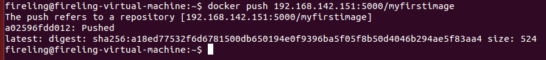

```
Docker部署私有仓库
Author：LiNing
```

Docker镜像能够以tar包的形式导出和导入，实现程序部署环境的迁移，也能够像github、bitbucket等版本仓库那样将镜像推送到Docker远程仓库上。

Docker仓库分为**公有仓库**和**私有仓库**，官方有个仓库叫**[Docker Hub](https://hub.docker.com/)**可以供Docker开发者实现镜像的推送和拉取，也支持公有仓库和私有仓库。但是网络问题，如果从官方仓库拉取镜像速度会很慢，而且有些涉及到重要项目的镜像推送到人家服务器上，即使是私有仓库，也是感觉不安全的。

对于公司进行Docker开发的话，应该维护自己一个内网的私有仓库。这样不仅便于下载速度快，节省网络带宽，针对于每个镜像不用每个人都去中央仓库上面去下载，只需要从私有仓库中下载即可，而且提供镜像资源利用，针对于公司内部使用的镜像，推送到本地的私有仓库中，以供公司内部相关人员使用。

#### 创建私有仓库的步骤如下：

* 首先需要有两台机器，一台作为仓库的**Server**，一台作为仓库的**Client**，用户通过**Client**来进行镜像的提交和拉取操作。

这里，采用两台虚拟机做例子：
	
	Ubuntu 14.04x64 Server：ip地址 192.168.142.151
	Ubuntu 14.04x64 Client：ip地址 192.168.142.152

* 在Server端启动registry容器：

启动命令：
	
	docker run -d --name registry -p 5000:5000 -v /opt/data/registry:/var/lib/registry --restart=always registry



这里建立了一个名为registry的守护式容器，挂载了服务器目录/opt/data/registry，映射端口为5000，这样在本地或者远程就可以通过该端口来访问仓库。

* 在Client端进行Docker配置：

修改配置文件**/etc/default/docker**，在DOCKER_OPTS中加入"**--insecure-registry 192.168.142.151:5000**"。这样把一个通过认证的安全证书加到Registry服务中。




修改完配置，要重启docker进程：
	
	sudo service docker restart

* 在Client端进行镜像的推送和拉取：

标签指定服务ip和端口，即仓库名：
	
	docker tag hello-world 192.168.142.151:5000/myfirstimage

向仓库推送镜像：
	
	docker push 192.168.142.151:5000/myfirstimage



删除本地镜像：	
	
	docker rmi 192.168.142.151:5000/myfirstimage

从仓库拉取镜像
	
	docker pull 192.168.142.151:5000/myfirstimage


	

	
	
	
