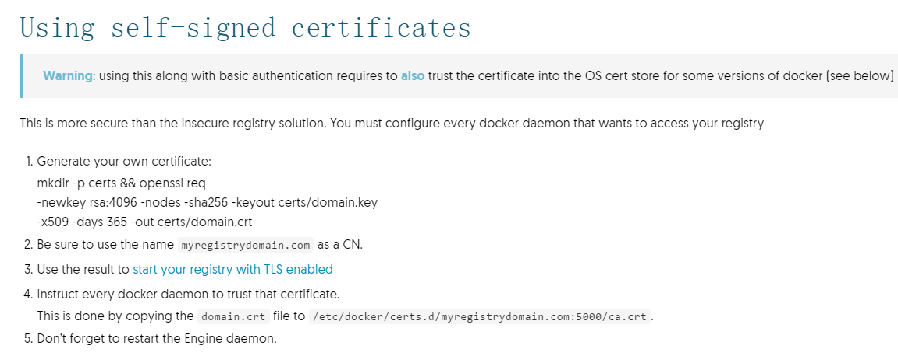
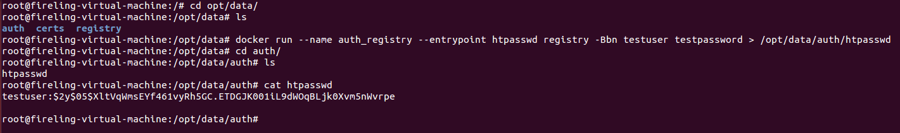
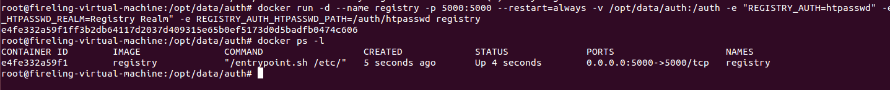
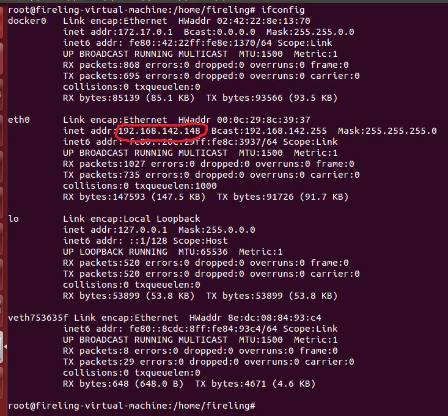
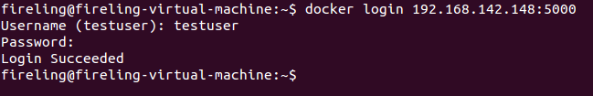

```
Docker私有仓库使用域名和限制登录
Author：LiNing
```

Docker私有仓库一般使用**Host:Port**形式来代表仓库名称，如果有域名指向这个**Host:Port**，那么我们可以使用域名来代表仓库名称，这样一方面比较容易记忆，另一方面不会轻易暴露Registry使用的IP和端口。

### 1. 使用域名登录：

前提：假设域名 **myregistrydomain.com** 指向 **xxx.xxx.xxx.xx:5000**，如果不想花钱的话，改本地host。

#### 在Registry服务端：

* 从CA提供商获取证书：

首先，你需要从一个CA提供商获取证书，如果在信任区域内，可以使用自签名证书，使用**openssl**生成。

其中，证书文件和秘钥文件分别为crt和key文件，分别拷贝到/opt/data/certs/domain.crt和/opt/data/certs/domain.key

	mkdir -p /opt/data/certs
	openssl req -newkey rsa:4096 -nodes -sha256 \ 
		-keyout /opt/data/certs/domain.key -x509 -days 365 \
		-out /opt/data/certs/domain.crt

官网上这么说的



使用自签名证书需要注意的一点就是，在设置CN（Common Name）的时候，把要配置的域名写上。

* 运行Docker服务：


	docker run -d --name registry -p 5000:5000 --restart=always \
		-v /opt/data/certs:/certs \ 
		-e REGISTRY_HTTP_TLS_CERTIFICATE=/certs/domain.crt \ 
		-e REGISTRY_HTTP_TLS_KEY=/certs/domain.key \ 
		registry

#### 在Registry客户端：

同样需要将服务端的证书**domain.crt**复制到客户端/etc/docker/certs.d/myregistrydomain.com:5000目录下，命名文件为**ca.crt**，其中**myregistrydomain.com:5000**为你注册的域名和使用的端口。

可以使用域名来代表仓库，进行push和pull操作，如：

	docker tag hello-world myregistrydomain.com:5000/myfirstimage
	docker push myregistrydomain.com:5000/myfirstimage
	docker rmi myregistrydomain.com:5000/myfirstimage
	docker pull myregistrydomain.com:5000/myfirstimage

### 2. 限制登录：

#### 在Registry服务端：

* 设置用户名和密码。
 


	这里，设置用户名为testuser，密码为testpassword.
	可以看到在生成的htpasswd中，保存了用户名和密码的相关信息。

* 运行Docker服务：


	docker run -d --name registry -p 5000:5000 --restart=always \ 
		-v /opt/data/auth:/auth \ 
		-e "REGISTRY_AUTH=htpasswd" 
		-e "REGISTRY_AUTH_HTPASSWD_REALM=Registry Realm" \ 
		-e REGISTRY_AUTH_HTPASSWD_PATH=/auth/htpasswd \ 
		registry
 


可以看到服务已经在Linux后台运行，并且服务器的5000端口指向了registry容器的5000端口，这样就可以通过“IP+端口”的方式进行访问了。

#### 在Registry客户端：

采用与登录Docker Hub一样的命令即可，如在服务器上看到的IP为192.168.142.148，则
 


输入命令：

	docker login 192.168.142.148:5000

会提示输入用户名和密码，输入正确则登录成功，接下来就可以进行push和pull操作了。

