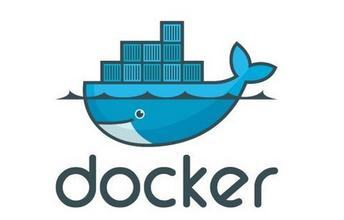

```
Dockerfile使用总结
Author：LiNing
```

Docker镜像采用的是**分层存储**的概念，制作镜像，实际上就是定制每一层所添加的配置、文件等。使用**"docker commit"**命令可以实现Docker镜像的制作，但是有很多不足，比如commit对镜像操作都是黑箱操作，除了制作镜像的人，其他人很难获知制作镜像的流程，而且每次操作都会在镜像当前层增加一层，并不能删除上一层的东西，这使得每次修改都会使镜像的体积越来越大。

Dockerfile解决了这些问题，它要求我们把**每一层构建的命令**都写入脚本，从而利用这个脚本来制作镜像。



#### 基于Dockerfile创建docker镜像

创建空目录，在空目录下创建Dockerfile：

	mkdir mydockerbuild
	cd mydockerbuild
	vim Dockerfile

Build操作，会自动读取当前路径下Dockerfile文件：

	docker build -t new_image .

#### Dockerfile命令介绍

FROM

	FROM <image>
	FROM <image>:<tag>
	FROM <image>@<digest>
	Dockerfile中非注释行的第一个指令
	如
		FROM ubuntu:14.04

MAINTAINER

	MAINTAINER LiNing <lining0806@gmail.com>

RUN 推荐使用数组形式

	RUN ["executable", "param1", "param2"] (exec form 作为"/bin/bash -c"的参数) 
	RUN command param1 param2 (shell form 作为"/bin/sh -c"的参数)
	如 
		RUN apt-get update && apt-get install -y \
			curl \
			nginx \
			&& rm -rf /var/lib/apt/lists/*
	RUN只是在构建镜像build的时候执行

CMD 推荐使用数组形式

	CMD ["executable", "param1", "param2"] (exec form 作为"/bin/bash -c"的参数) 
	CMD command param1 param2 (shell form 作为"/bin/sh -c"的参数)
	CMD ["param1", "param2"] (as default parameters to ENTRYPOINT)
	如 
		CMD ["/bin/echo", "this is a echo test"]
		docker run -it new_image
	CMD会在启动容器run时执行，构建镜像build时不执行
	如果用户启动容器run时指定了运行的命令，则会覆盖掉CMD指定的命令
	CMD只有最后一个有效

ENTRYPOINT 推荐使用数组形式

	ENTRYPOINT ["executable", "param1", "param2"] (exec form 作为"/bin/bash -c"的参数) 
	ENTRYPOINT command param1 param2 (shell form 作为"/bin/sh -c"的参数)
	如 
		ENTRYPOINT ["/bin/echo"]
		CMD ["this is a echo test"] # 如果docker run期间如果没有参数的传递，会默认CMD指定的参数
		docker run -it new_image "this is a test"
	ENTRYPOINT会在启动容器run时执行，构建镜像build时不执行
	如果用户启动容器run时指定了运行的命令，则不会覆盖掉ENTRYPOINT指定的命令，可以使用docker run --entrypoint覆盖Dockerfile中的ENTRYPOINT
	ENTRYPOINT只有最后一个有效

EXPOSE

	EXPOSE <port> [<port>...]
	Docker服务端容器对外映射的本地端口，需要在启动容器run时使用-p或者-P选项生效

LABEL

	LABEL <key>=<value> <key>=<value> <key>=<value> ...

ENV

	ENV <key> <value>       # 只能设置一个变量
	ENV <key>=<value> ...   # 允许一次设置多个变量

VOLUME

	VOLUME ["<path1>", "<path2>", ...]
	VOLUME <path>
	将本地主机目录挂载到目标容器中，将其他容器挂载的挂载点挂载到目标容器中

ADD

	ADD <src>... <dest>，源可以是URL
	ADD local_tar_file /temp 复制当前目录下文件到容器/temp目录，如果是压缩文件则自动解压缩复制

COPY

	COPY <src>... <dest>，源不可以是URL
	COPY local_files /temp 复制当前目录下文件到容器/temp目录

USER

	USER <user>
	指定运行容器时的用户名或UID，后续的RUN、CMD、ENTRYPOINT也会使用指定用户

WORKDIR

	WORKDIR <path>
	进入容器的默认路径，相当于cd，后续的RUN、CMD、ENTRYPOINT也会使用指定路径

ONBUILD

	ONBUILD [instruction]
	使用该dockerfile生成的镜像A，并不执行ONBUILD中命令，如再来个dockerfile基础镜像为镜像A时，生成的镜像B时就会执行ONBUILD中的命令

#### Dockerfile优化手段

* 容器能快速迭代
* 使用.dockerignore文件
* 不要安装不必要的程序包
* 单一容器只运行单一进程
* 最小化镜像层数
* 对多行参数进行排序
* 构建镜像使用缓存