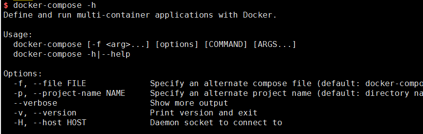
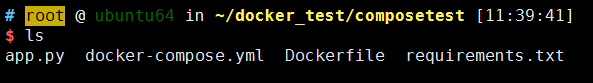
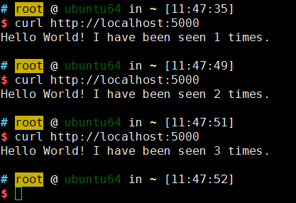
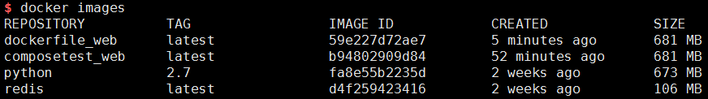

创建一个容器，我们可以通过**Dockerfile**模板文件对镜像进行创建并按照配置要求启动。然而，一般项目往往需要多个容器相互配合才能完成某项任务，比如说在一个web项目中，除了web服务容器，往往还需要后端的数据库服务容器，甚至还需要负载均衡容器等。如何有效地做好容器之间的编排，是**Docker Compose**要做的内容。

Docker Compose是**定义和运行多个Docker容器的工具**，它主要管理一个**项目(project)**，这个项目是由一组关联的应用容器组成的一个完整业务单元，而每个应用容器则对应一个**服务(service)**，当然服务可能只包含一个**容器(container)**实例，也可能包括若干运行相同镜像的**容器(container)**实例。

Docker Compose的核心就在于**“一个文件”**和**“一条命令”**。所谓**“一个文件”**，是指docker-compose.yml，在这个文件中我们可以进行项目的配置，包括服务的定义。而**“一条命令”**则指，我们只需要类似docker-compose up这样简单的命令即可管理项目。其他帮助和命令，我们可以通过**docker-compose -h**进行查询。

为了更好地理解docker-compose如何进行容器编排，下面运行一个python web应用，其中web框架基于flask，计数器基于redis。

##### 我们要实现的效果就是，每访问一次web服务网址，计数器对应加1。

### 创建项目目录

如果在启动项目时，如果没有指定具体的项目名称，则项目所在的目录名作为默认的项目名称。

	mkdir composetest
	cd composetest

### 使用Dockerfile定义镜像配置

在composetest目录下，创建3个文件，内容依次为：

app.py

	#coding: utf-8
	from flask import Flask
	from redis import Redis
	app = Flask(__name__)
	redis = Redis(host='redis', port=6379) # redis对应redis容器的别名
	@app.route('/')
	def hello():
		count = redis.incr('hits')
		return 'Hello World! I have been seen {} times.\n'.format(count)
	if __name__ == "__main__":
		app.run(host="0.0.0.0", debug=True)

requirements.txt

	flask
	redis

Dockefile

	FROM python:2.7
	ADD . /code
	WORKDIR /code
	RUN pip install -r requirements.txt
	CMD ["python", "app.py"]

这样，我们定义了web服务镜像的配置。在第一次启动项目的时候，docker-compose会使用Dockerfile创建一个名为composetest_web的镜像。

### 使用Docker Compose来管理项目

#### 定义项目配置文件docker-compose.yml

在composetest目录下，创建docker-compose.yml，内容为：

	version: '3'
	services:
	 web:
	  build: .
	  ports:
	   - "5000:5000"
	  volumes:
	   - .:/code
	 redis:
	  image: redis

docker-compose.yml中定义了web和redis服务，对于web服务：

	build	在当前目录从Dockerfile创建一个镜像
	ports	端口映射，开放容器5000端口映射到宿主机5000端口
	volumes	挂载数据卷，挂载容器目录/code对应到宿主机当前目录

此时我们需要的文件都准备好了，开始启动项目：

	docker-compose up

此时我们可以通过浏览器访问对应的 http://ip:5000 地址，如果在服务本地访问，则对应 http://localhost:5000 。

可以看到每访问一次web服务地址，计数器对应加1。如果要更新应用，因为挂载了数据卷，只需修改app.py保存即可。

### 使用容器互联

除了使用docker-compose来进行容器编排，如果情况不太复杂，我们也可以使用容器互联的手段实现项目需求。容器互联要求针对多个容器，分别按顺序启动并指明依赖关系，也就是利用好**"--link"**这个参数。

同样，在composetest目录下，先启动redis服务容器：

	docker run -d --name redis redis

创建web服务镜像：

	docker build -t dockerfile_web .

通过查看镜像，可以看到生成的dockerfile_web镜像，在docker-compose.yml中定义的服务依赖的镜像也已经具备了，如composetest_web。由于dockerfile_web和composetest_web镜像都是由同一个Dockerfile模板文件生成的，本质上它们是一样的。

启动web服务容器，并关联redis服务容器：

	docker run --name web -p 5000:5000 -v $(pwd):/code --link redis:webredis dockerfile_web

这样也能得到同样的效果，但是，对于复杂的容器编排情况，还是乖乖地使用docker-compose等利器吧。
